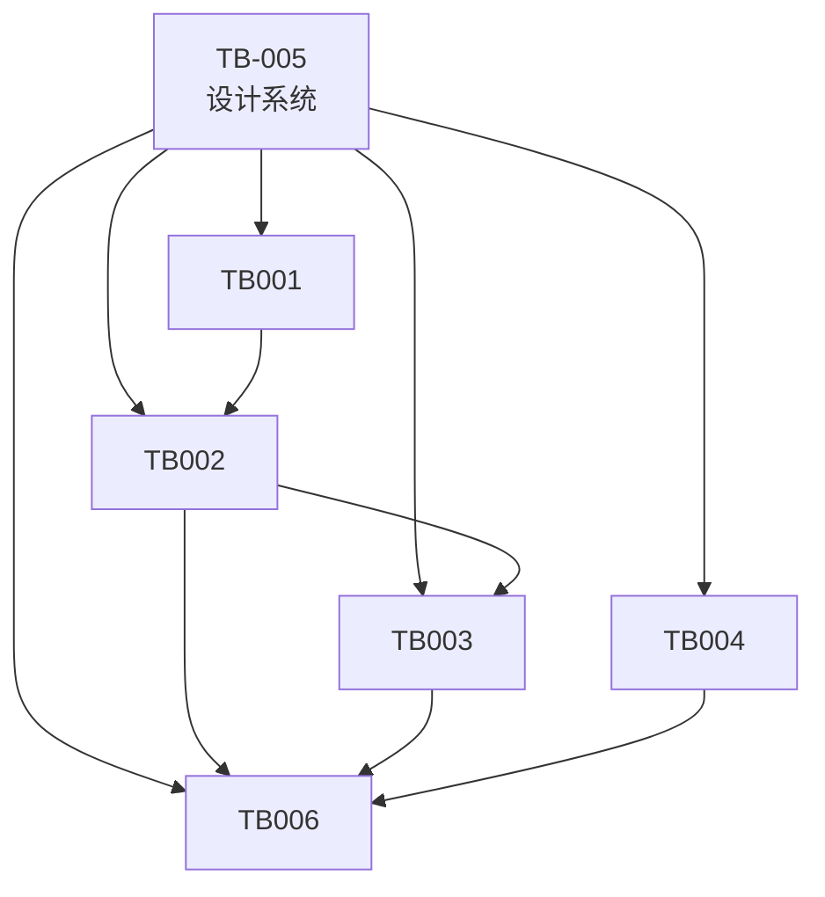

# Pebble AI 项目任务书总览

## 项目简介

**项目名称**: Pebble AI 情绪防御助手
**项目代号**: pebble-ai
**创建日期**: 2026-03-16
**最后更新**: 2026-03-19

---

## 文档清单

### 项目文档

| 序号 | 文档名称 | 路径 | 描述 |
|-----|---------|------|------|
| 1 | **项目概述与索引** | `./01-项目概述与索引.md` | 项目基本信息、功能模块、任务书索引 |
| 2 | **技术架构设计** | `./02-技术架构设计.md` | 整体技术架构、目录结构、状态管理、API设计 |
| 3 | **验收测试方案** | `./03-验收测试方案.md` | 验收标准、测试用例、检查清单 |

### 功能任务书

| 序号 | 任务书编号 | 任务书名称 | 优先级 | 工期 | 依赖 | 状态 |
|-----|-----------|-----------|-------|------|------|------|
| 1 | **TB-005** | 设计系统与组件库预研 | P0 | 3-5天 | 无 | 已完成 |
| 2 | **TB-001** | 首页模块技术预研 | P0 | 3-4天 | TB-005 | 待启动 |
| 3 | **TB-002** | 读心翻译器技术预研 | P0 | 4-5天 | TB-005, TB-001 | 待启动 |
| 4 | **TB-003** | 模拟陪练场技术预研 | P0 | 5-6天 | TB-005, TB-002 | 待启动 |
| 5 | **TB-004** | 急救呼吸技术预研 | P1 | 3-4天 | TB-005 | 待启动 |
| 6 | **TB-006** | 后端 BFF 与接口技术预研 | P0 | 5-7天 | TB-005, TB-002, TB-003, TB-004 | 待启动 |

---

## 依赖关系图



**依赖说明**:
- **TB-005 (设计系统)** 是所有其他任务书的基础依赖
- **TB-001 (首页)** 依赖设计系统完成
- **TB-002 (翻译器)** 依赖首页和导航组件
- **TB-003 (陪练场)** 依赖翻译器的分析功能
- **TB-004 (呼吸)** 相对独立，仅依赖设计系统
- **TB-006 (后端 BFF)** 依赖设计系统和三个功能页的最终接口契约

---

## 执行顺序建议

### 方案一：串行执行（推荐）

```
Week 1:
├── Day 1-3: TB-005 (设计系统)
└── Day 4-5: TB-001 (首页)

Week 2:
├── Day 1-3: TB-002 (翻译器)
└── Day 4-5: TB-004 (呼吸) - 并行

Week 3:
└── Day 1-5: TB-003 (陪练场)

Week 4:
└── 集成测试、优化、文档完善
```

### 方案二：并行执行（团队配合）

```
Week 1:
├── 开发者A: TB-005 (设计系统) - Day 1-5
└── 开发者B: 等待设计系统完成

Week 2:
├── 开发者A: TB-001 (首页) - Day 1-3
└── 开发者B: TB-004 (呼吸) - Day 1-3 (并行)

Week 3:
├── 开发者A: TB-002 (翻译器) - Day 1-4
└── 开发者B: 协助测试

Week 4:
└── 开发者A+B: TB-003 (陪练场) - Day 1-5
```

---

## 技术栈确认

| 技术 | 版本 | 用途 | 任务书 |
|-----|------|------|--------|
| Next.js | 15.x | React框架 | 所有 |
| TypeScript | 5.x | 类型系统 | 所有 |
| Tailwind CSS | 4.x | 样式系统 | TB-005 |
| shadcn/ui | latest | UI组件库 | TB-005 |
| Framer Motion | 11.x | 动画库 | TB-004, TB-005 |
| Zustand | 5.x | 状态管理 | TB-002, TB-003 |
| Immer | 10.x | 不可变更新 | TB-002, TB-003 |
| Lucide React | latest | 图标库 | 所有 |

---

## 设计系统规范速查

### 颜色
```
pebble-rock:     #7D8C9F  (灰岩蓝 - 主色)
pebble-healing:  #A8D8B9  (安全绿 - 强调)
pebble-bg:       #F0F6F2  (背景)
pebble-accent:   #BCA564  (金色)
pebble-warn:     #E07A5F  (警告)
```

### 字体
```
serif:   Noto Serif SC    (标题)
sans:    Noto Sans SC     (正文)
display: Public Sans      (英文)
```

### 圆角
```
pebble:   60% 40% 70% 30% / 40% 50% 60% 40%
pebble-1: 2rem 3rem 2.5rem 4rem
pebble-2: 4rem 2rem 3.5rem 2.5rem
pebble-3: 3rem 4rem 2rem 3.5rem
```

---

## 参考文件位置

| 文件类型 | 路径 |
|---------|------|
| 首页设计稿 | `/docs/frontend/pebble_home_page.html` |
| 翻译器设计稿 | `/docs/frontend/pebble_translator.html` |
| 陪练场设计稿 | `/docs/frontend/pebble_dojo.html` |
| 呼吸页设计稿 | `/docs/frontend/pebble_breathing.html` |

---

## 项目目录结构

```
/Users/xyh/Code/pebble/
├── apps/
│   └── web/                    # Next.js 项目
│       ├── src/
│       │   ├── app/            # 页面路由
│       │   ├── components/     # 组件
│       │   ├── hooks/          # 自定义 Hooks
│       │   ├── lib/            # 工具函数
│       │   ├── store/          # 状态管理
│       │   └── types/          # TypeScript 类型
│       ├── public/             # 静态资源
│       └── package.json
│
├── docs/
│   ├── frontend/               # 设计稿 HTML
│   │   ├── pebble_home_page.html
│   │   ├── pebble_translator.html
│   │   ├── pebble_dojo.html
│   │   └── pebble_breathing.html
│   │
│   └── taskbook/               # 任务书文档
│       ├── 00-任务书总览.md
│       ├── 01-项目概述与索引.md
│       ├── 02-技术架构设计.md
│       ├── 03-验收测试方案.md
│       ├── TB-001-首页模块技术预研.md
│       ├── TB-002-读心翻译器技术预研.md
│       ├── TB-003-模拟陪练场技术预研.md
│       ├── TB-004-急救呼吸技术预研.md
│       └── TB-005-设计系统与组件库预研.md
│
├── package.json                # 根 package.json
├── pnpm-workspace.yaml         # pnpm workspace 配置
└── turbo.json                  # Turbo 配置
```

---

## 联系方式

- **项目地址**: `/Users/xyh/Code/pebble/`
- **技术负责人**: Claude Code
- **最后更新**: 2026-03-19

---

**文档版本**: v1.0
**创建日期**: 2026-03-16
